# SIRUNTIR - Sistem Informasi Ruang UNTIRTA

SIRUNTIR adalah aplikasi web berbasis Laravel untuk mempermudah proses peminjaman ruang di lingkungan kampus.
SIRUNTIR memiliki fitur pengelolaan user, pengelolaan ruangan, peminjaman ruangan, dan laporan peminjaman.

Berikut adalah tampilan webnya serta pedoman penggunaan web

# Tampilan Login
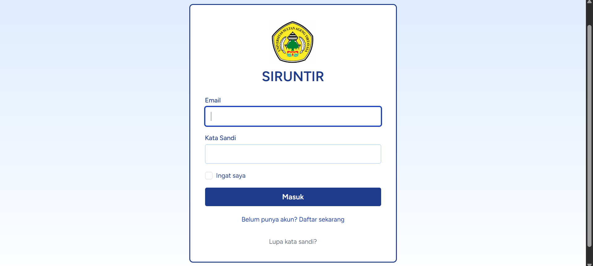
Pengguna akan diarahkan ke halaman login saat membuka web

# Tampilan Register
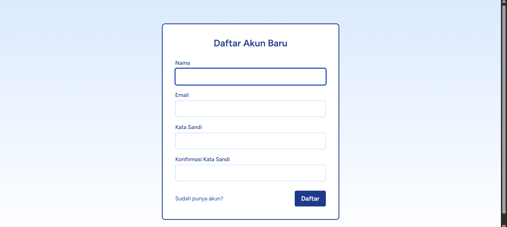
Jika penggguna belum memiliki akun, maka akan diarahkan ke halaman register untuk membuat akun

# Tampilan Dahboard User
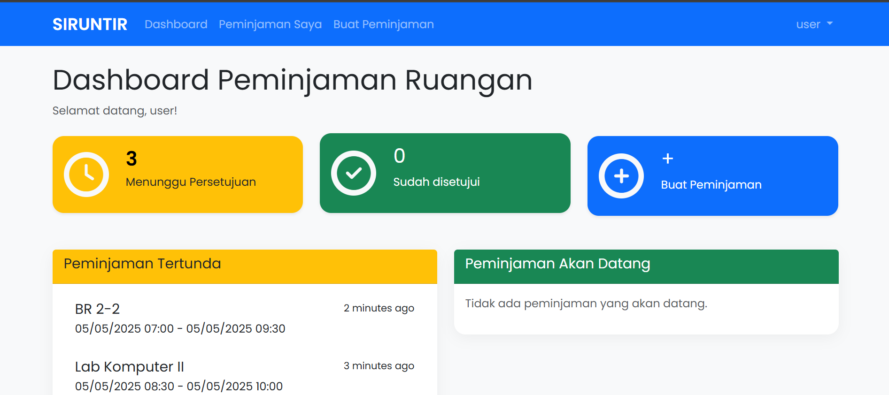

# Tampilan Membuat Peminjaman Ruangan
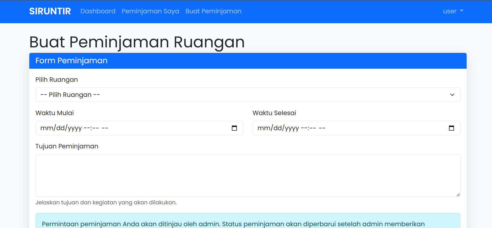
User bisa membuat peminjaman baru melalui halaman "Buat Peminjaman"

# Tampilan Daftar Pinjam
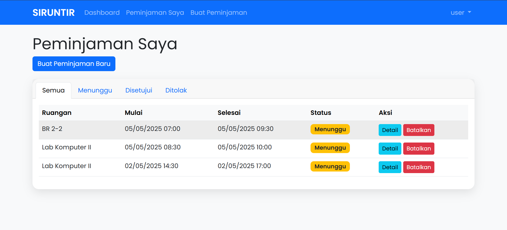
Daftar ruangan yang sedang dipinjam oleh user akan ditampilkan di daftar ini

# Kalender
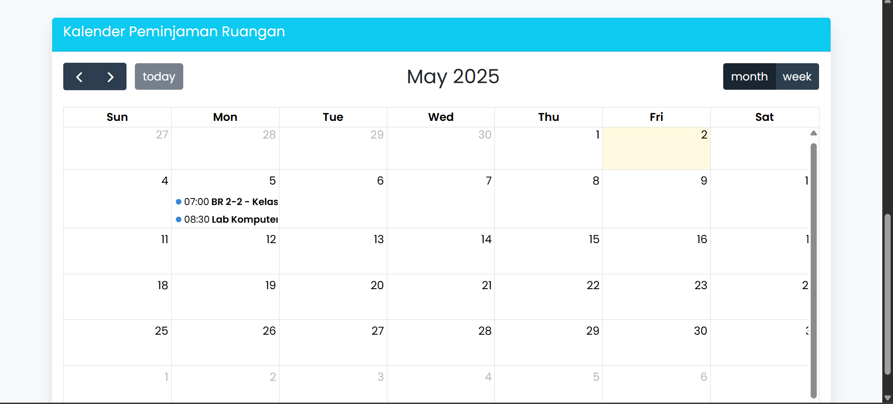
Jadwal peminjaman ruangan akan ditampilkan pada kalender

# Dashboard Admin
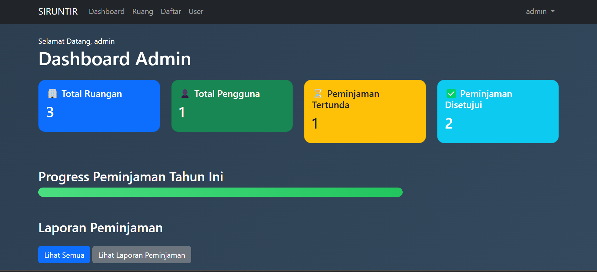
Jika admin melakukan registrasi atau log-in, maka nanti akan langsung diarahkan ke dashboard admin

# Daftar Ruangan
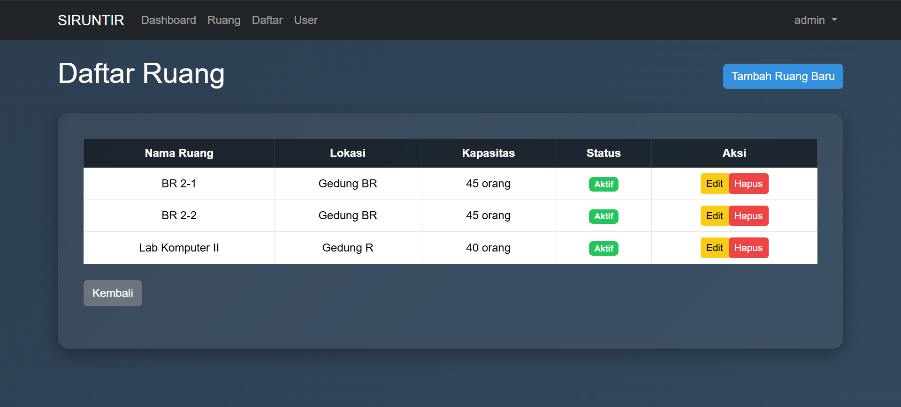
Semua ruangan yang ditambahkan oleh admin akan dimunculkan pada halaman ini, admin dapat menghapus maupun meemperbarui spesifikasi ruangan

# Tampilan Tambah Ruangan
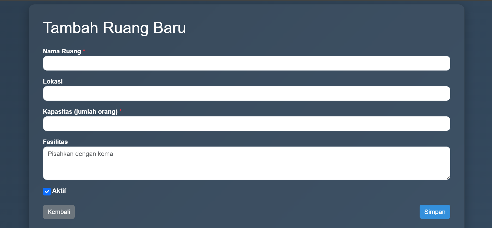
Admin dapat menambah ruangan

# Daftar User
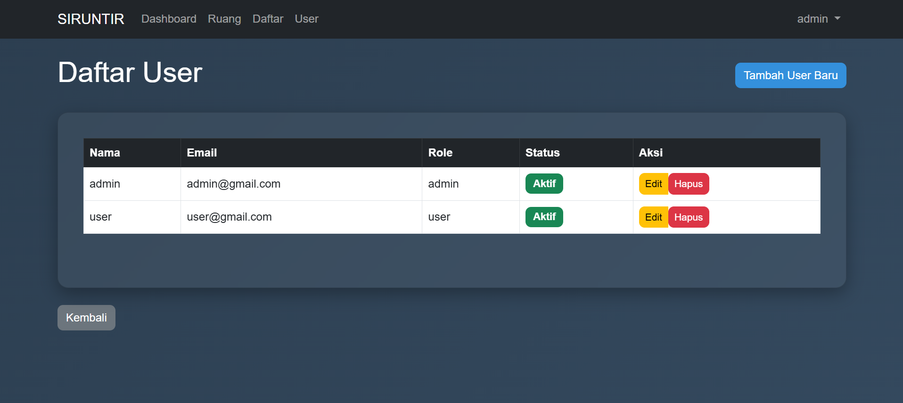
Admin dapat melihat daftar user yang menggunakan website ini, admin juga dapat menghapus atau memperbarui profil user maupun role user

# Tambah Daftar User
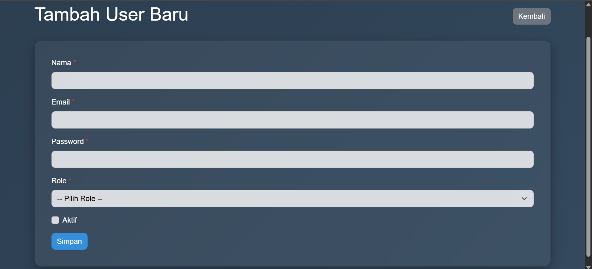
User dapat ditambahkan oleh admin secara manual

# Daftar Peminjaman Pada Halaman Admin
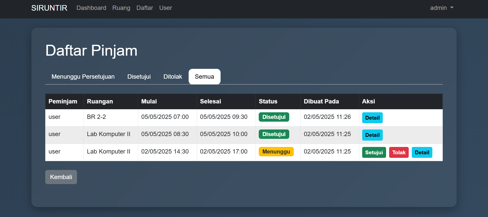
Peminjaman ruangan yang sudah diajukan oleh user akan terlihat di halaman ini dan admin dapat menyetujui maupun menolak permintaan tersebut

# Laporan Peminjaman
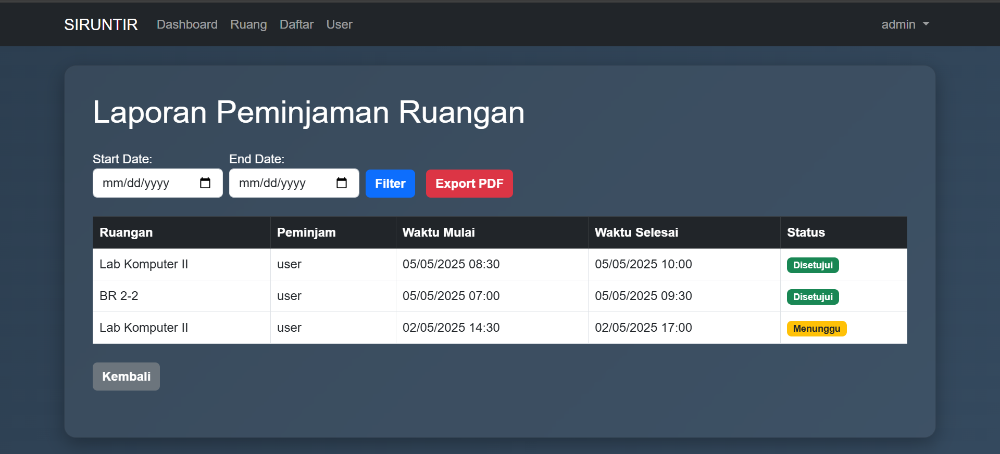
Admin dapat meng-export laporan peminjaman menjadi format PDF

